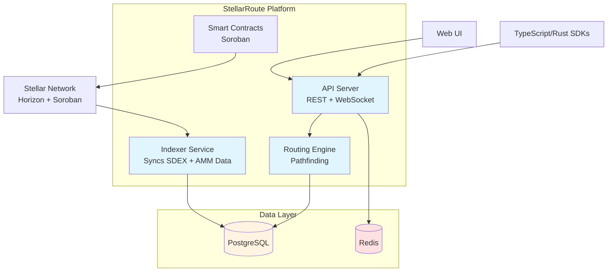

# StellarRoute

**Open-source DEX aggregation engine and UI that delivers best-price routing across the Stellar DEX (SDEX) orderbook and Soroban AMM pools.**

[](LICENSE)
[](https://www.rust-lang.org)
[](https://soroban.stellar.org)
[](CONTRIBUTING.md)

> **🌟 Actively seeking contributors!** We're building critical infrastructure for the Stellar ecosystem and need help from developers of all skill levels. Check out our [open issues](../../issues) to get started.

---

## 🚀 Overview

StellarRoute is a comprehensive DEX aggregation platform built for the Stellar ecosystem. It **solves a critical gap** left by the deprecation of the SDEX Explorer by providing unified price discovery and optimal routing across both traditional Stellar DEX (SDEX) orderbooks and modern Soroban-based AMM pools.

### The Problem We're Solving

Stellar users currently face:

- **Fragmented liquidity** between SDEX and Soroban AMM pools
- **No unified price discovery** across different trading venues
- **Suboptimal trade execution** due to lack of intelligent routing
- **Loss of SDEX Explorer** functionality without a clear replacement

StellarRoute addresses these challenges by building open-source infrastructure that benefits traders, developers, and the entire Stellar ecosystem.

### What We're Building

- **Unified Liquidity Aggregation**: Index and aggregate liquidity from SDEX orderbooks and Soroban AMM pools
- **Intelligent Routing Engine**: Multi-hop pathfinding algorithm that discovers optimal trade routes across multiple liquidity sources
- **Smart Contracts**: Soroban-based router contracts for secure, on-chain swap execution
- **Developer SDKs**: Easy-to-use JavaScript/TypeScript and Rust SDKs for integrations
- **Web Interface**: Modern, intuitive UI for traders with real-time price updates and wallet integration
- **High Performance**: Sub-500ms API response times with real-time orderbook synchronization

---

## ✨ Key Features

### Core Capabilities

- ✅ **Best Price Discovery**: Automatically find the best execution price across all liquidity sources
- ✅ **Multi-Hop Routing**: Support for complex multi-step trades (e.g., XLM → USDC → BTC)
- ✅ **Price Impact Analysis**: Real-time calculation of price impact and slippage
- ✅ **Real-Time Indexing**: Continuous synchronization of SDEX and AMM pool states
- ✅ **Developer-Friendly**: Comprehensive SDKs and APIs for easy integration

### For Traders

- Execute swaps at the best available prices
- Visualize trade routes and price impact before execution
- Access deep liquidity across multiple sources
- Set custom slippage tolerance

### For Developers

- REST API for price quotes and orderbook data
- WebSocket support for real-time updates
- JavaScript/TypeScript SDK for web applications
- Rust SDK for backend integrations
- CLI tools for power users

---

## 🏗️ Architecture

StellarRoute is built with a modular architecture consisting of several key components. See our [comprehensive architecture diagrams](docs/architecture/diagrams.md) for detailed visualizations.

### High-Level Overview



### Core Components

1. **Indexer Service**: Syncs SDEX orderbooks and Soroban AMM pool states from Stellar Horizon API
2. **Routing Engine**: Pathfinding algorithms for optimal multi-hop route discovery
3. **API Server**: REST/WebSocket endpoints serving quotes and orderbook data
4. **Smart Contracts**: Soroban contracts for on-chain swap execution
5. **Frontend UI**: React-based web interface for traders
6. **SDKs**: TypeScript and Rust libraries for developers

📊 **[View Detailed Architecture Diagrams →](docs/architecture/diagrams.md)**

---

## 🛠️ Technology Stack

### Backend

- **Language**: Rust (for performance and safety)
- **Framework**: Axum/Actix-web (API server)
- **Database**: PostgreSQL (orderbook storage)
- **Cache**: Redis (hot data caching)
- **Blockchain**: Soroban (smart contracts)

### Frontend

- **Framework**: React/Next.js
- **Language**: TypeScript
- **Styling**: Tailwind CSS + shadcn/ui
- **State Management**: React hooks + context
- **Wallet Integration**: Freighter, XBull

### Infrastructure

- **CI/CD**: GitHub Actions
- **Containerization**: Docker & Docker Compose
- **Monitoring**: Prometheus/Grafana (planned)

---

## 📊 Current Status & Contribution Opportunities

**Milestone**: M1 - Prototype Indexer & API ✅ **COMPLETE!**  
**Next Phase**: M2 - Soroban AMM Integration  
**Status**: 🎯 **Ready for Production Testing** | **Actively seeking contributors**  
**Milestone Progress**: 100% Complete

### Why Contribute to StellarRoute?

- 🎯 **High-impact work**: Building critical Stellar ecosystem infrastructure
- 📚 **Learn Rust & Soroban**: Gain hands-on experience with cutting-edge blockchain technology
- 🤝 **Collaborative environment**: Work with experienced Stellar developers
- 🏆 **Recognition**: Build your portfolio with verifiable open-source contributions
- 💡 **Clear tasks**: Well-defined issues suitable for all skill levels

### ✅ Recent Progress (Phase 1.2)

**Phase 1.1 Complete:**

- ✅ Rust workspace structure (5 modular crates)
- ✅ Docker Compose setup for local development
- ✅ CI/CD pipeline with GitHub Actions
- ✅ Comprehensive documentation structure

**Phase 1.2 Complete (✅ 100%):**

- ✅ Database schema created (`migrations/0001_init.sql`)
- ✅ Stellar Horizon API client implemented
- ✅ Data models for Assets and Offers with validation
- ✅ Database connection pooling with sqlx
- ✅ SDEX indexer service with dual modes (polling & streaming)
- ✅ Main indexer binary created
- ✅ Retry logic with exponential backoff (3 retries, 100ms-5s)
- ✅ Real-time streaming support (polling-based, SSE-ready)
- ✅ Orderbook snapshot endpoint (`/order_book`)
- ✅ Comprehensive data validation

**Phase 1.3 Complete (✅ 100%):**

- ✅ Performance indexes (11 strategic indexes for common queries)
- ✅ Data archival system (30-day retention, SQL functions)
- ✅ Database health monitoring (metrics, pool stats, table sizes)
- ✅ Query optimizations (materialized views, denormalized views)
- ✅ HealthMonitor & ArchivalManager Rust modules

**Phase 1.4 Complete (✅ 100%):**

- ✅ Axum-based REST API framework
- ✅ Core endpoints (pairs, orderbook, quote, health)
- ✅ Request/response models with validation
- ✅ Rate limiting middleware (100 req/min)
- ✅ OpenAPI/Swagger documentation (interactive UI)
- ✅ CORS support for web clients
- ✅ Comprehensive error handling

**Phase 1.5 Complete (✅ 100%):**

- ✅ Redis caching layer (optional, graceful fallback)
- ✅ Smart TTLs: pairs (10s), orderbook (5s), quotes (2s)
- ✅ Gzip response compression (tower-http)
- ✅ Cache manager with health checks
- ✅ Unit tests (5 passing)

### 🔥 Active Development Areas (Help Wanted!)

We're currently building M1 (Prototype Indexer & API) and need help with:

1. **SDEX Indexer Enhancement** 🚀
   - Add retry logic with exponential backoff
   - Implement real-time streaming (SSE from Horizon)
   - Verify and implement orderbook snapshot endpoint
   - Add comprehensive unit tests
   - _Skills: Rust, API integration, Error handling_

2. **Database Optimization** 💾
   - Query performance tuning and indexes
   - Add database health monitoring
   - Implement data archival strategy
   - Schema optimization based on query patterns
   - _Skills: PostgreSQL, SQL, Performance tuning_

3. **API Development** 🔌
   - Implement REST API server (Axum/Actix)
   - Create `/api/v1/pairs` endpoint
   - Add `/api/v1/orderbook/{base}/{quote}` endpoint
   - Add `/api/v1/quote` endpoint
   - WebSocket support for real-time updates
   - _Skills: Rust (Axum/Actix), REST APIs, WebSocket_

4. **Testing & Documentation** ✅
   - Unit tests for indexer, models, and database layer
   - Integration tests with test database
   - API documentation (OpenAPI/Swagger)
   - Code examples and tutorials
   - _Skills: Testing, Technical writing_

5. **Infrastructure & Monitoring** ⚡
   - Add structured logging with tracing crate
   - Implement health check endpoint
   - Set up metrics collection
   - Redis caching layer
   - Rate limiting middleware
   - _Skills: Observability, Redis, Performance_

### 📋 Next Immediate Tasks

1. Test indexer with local Postgres database
2. Add retry logic for transient Horizon API failures
3. Implement Horizon streaming (SSE) for real-time updates
4. Research and verify orderbook snapshot endpoint
5. Create REST API server with core endpoints
6. Add comprehensive error handling and logging
7. Write unit and integration tests

**👉 Ready to contribute?** Check our [Issues](../../issues) page for tasks tagged by difficulty level (`good-first-issue`, `help-wanted`, `beginner-friendly`).

---

## 🚦 Getting Started

### Prerequisites

- Rust 1.75+ (installation instructions in [SETUP.md](docs/development/SETUP.md))
- Soroban CLI
- Docker & Docker Compose
- PostgreSQL 15+
- Node.js 18+ (for frontend development)

### Quick Start

1. **Clone the repository**

   ```bash
   git clone https://github.com/yourusername/StellarRoute.git
   cd StellarRoute
   ```

2. **Install Rust and Soroban CLI**
   Follow the detailed instructions in [docs/development/SETUP.md](docs/development/SETUP.md)

3. **Start local services**

   ```bash
   docker-compose up -d
   ```

4. **Build the project**

   ```bash
   cargo build
   ```

5. **Run tests**
   ```bash
   cargo test
   ```

For detailed setup instructions, see the [Development Setup Guide](docs/development/SETUP.md).

---

## 📦 Project Structure

```
StellarRoute/
├── crates/
│   ├── indexer/       # SDEX & Soroban indexing service
│   ├── api/           # REST API server
│   ├── routing/       # Routing engine & pathfinding
│   ├── contracts/     # Soroban smart contracts
│   └── sdk-rust/      # Rust SDK for developers
├── frontend/          # Web UI (React/Next.js) [planned]
├── sdk-js/            # JavaScript/TypeScript SDK [planned]
├── docs/              # Documentation
│   ├── architecture/  # Architecture documentation
│   ├── api/          # API reference
│   ├── development/  # Development guides
│   └── deployment/   # Deployment guides
├── scripts/          # Setup and utility scripts
├── docker-compose.yml # Local development services
├── Roadmap.md        # Detailed development roadmap
└── README.md         # This file
```

---

## 📈 Development Roadmap

For the complete development roadmap with detailed milestones, phases, and technical tasks, see [Roadmap.md](Roadmap.md).

---

## 🤝 Contributing

**We actively welcome contributions from developers of all skill levels!** StellarRoute is open-source and built for the Stellar ecosystem by the community.

### Quick Start for Contributors

1. **Browse Issues**: Check our [Issues](../../issues) page for tasks
   - 🟢 `good-first-issue` - Perfect for newcomers
   - 🟡 `help-wanted` - Ready for contribution
   - 🔵 `beginner-friendly` - Minimal context needed

2. **Join the Discussion**: Comment on an issue to claim it or ask questions

3. **Fork & Code**: Fork the repo, create a feature branch, and start coding

4. **Submit PR**: Open a pull request with clear description of changes

5. **Review & Merge**: Collaborate with maintainers on code review

### Ways to Contribute

- 🐛 **Fix bugs** - Help us squash issues
- ✨ **Add features** - Implement new functionality
- 📝 **Improve docs** - Enhance guides and API documentation
- 🧪 **Write tests** - Increase code coverage
- ⚡ **Optimize performance** - Make it faster and more efficient
- 🎨 **UI/UX improvements** - Enhance the frontend experience (M4)

### Contribution Guidelines

- Write clean, well-documented Rust code
- Follow existing code style and patterns
- Add tests for new functionality
- Update documentation as needed
- Keep PRs focused and atomic

**New to Stellar or Rust?** No problem! We have mentorship available and beginner-friendly issues to help you get started.

**Questions?** Open a discussion or comment on an issue - we're here to help!

---

## 📄 License

This project is licensed under the MIT License - see the [LICENSE](LICENSE) file for details.

---

## 🔗 Resources

- **Stellar Documentation**: https://developers.stellar.org
- **Soroban Documentation**: https://soroban.stellar.org
- **Horizon API Reference**: https://developers.stellar.org/api/horizon
- **Project Roadmap**: [Roadmap.md](Roadmap.md)
- **Development Setup**: [docs/development/SETUP.md](docs/development/SETUP.md)

---

## 📞 Support & Community

- **Issues**: [GitHub Issues](../../issues)
- **Discussions**: [GitHub Discussions](../../discussions)
- **Documentation**: [docs/](docs/)

---

## 🎯 Vision

Our goal is to create the most efficient, user-friendly, and developer-centric DEX aggregation platform on Stellar. By combining SDEX orderbook depth with Soroban AMM liquidity, we're building infrastructure that will help traders get the best prices while making it easy for developers to integrate sophisticated trading functionality into their applications.

### Impact on the Stellar Ecosystem

- **For Traders**: Best execution prices and transparent routing
- **For Developers**: Easy-to-integrate SDKs and comprehensive APIs
- **For DeFi Projects**: Foundation for building advanced trading applications
- **For the Ecosystem**: Critical infrastructure filling the SDEX Explorer gap

---

## 🏆 Recognition & Community

This project is part of the **Stellar open-source ecosystem** and actively participates in community initiatives.

- **Stellar Development Foundation** ecosystem project
- **Open for Drips Wave** participation
- **Community-driven** development with transparent progress tracking

---

## 💬 Get Involved

- 💼 **Issues & Tasks**: [GitHub Issues](../../issues)
- 💭 **Discussions**: [GitHub Discussions](../../discussions)
- 📖 **Documentation**: [docs/](docs/)
- 🗺️ **Roadmap**: [Roadmap.md](Roadmap.md)

**We're actively building and need your help!** Whether you're a Rust expert or just starting your blockchain journey, there's a place for you in StellarRoute.

**Built with ❤️ for the Stellar ecosystem**
