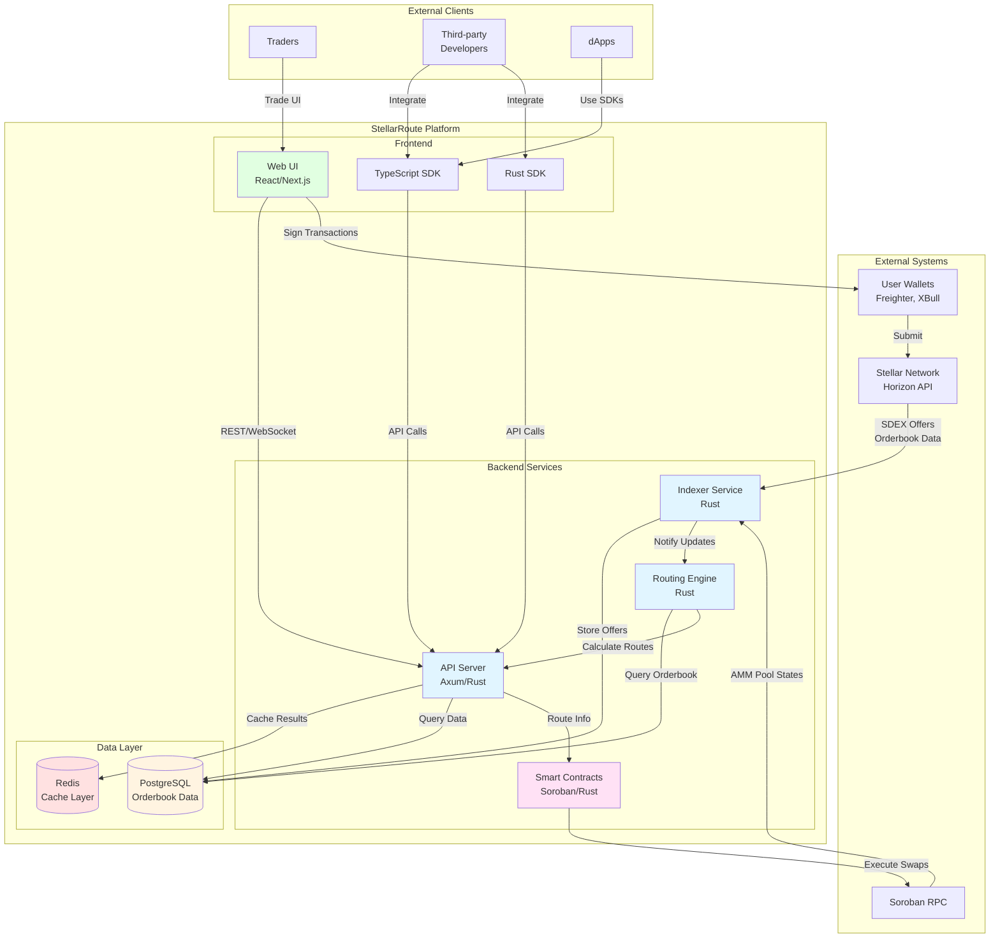
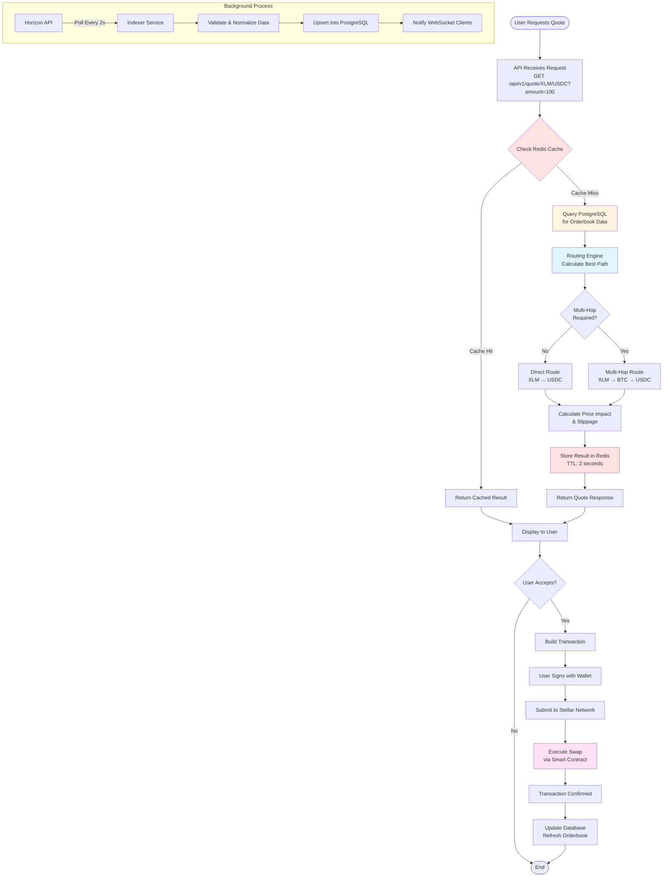
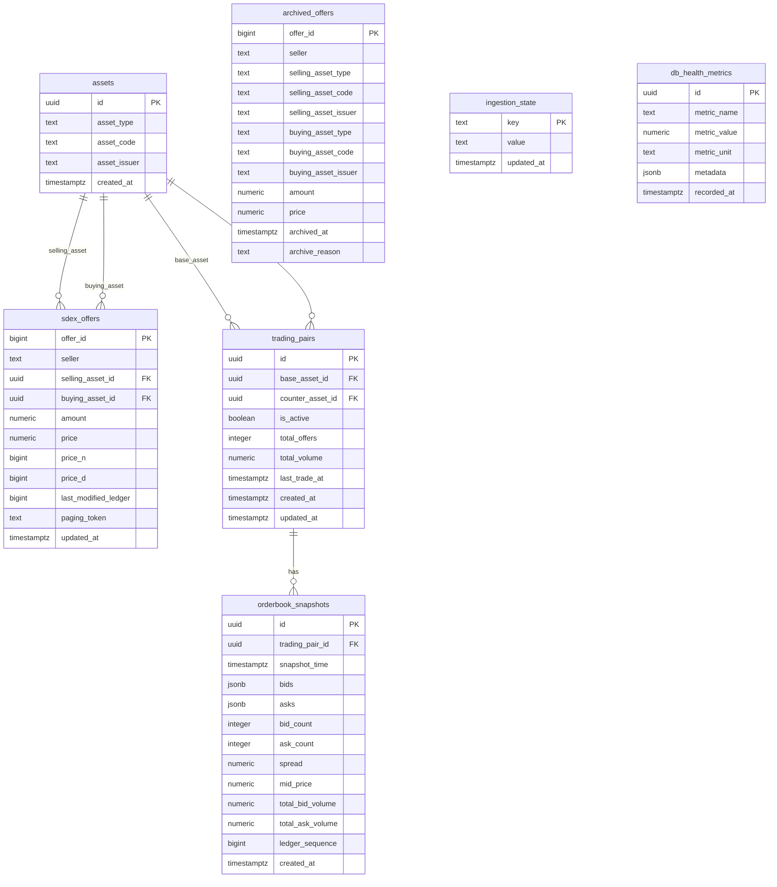
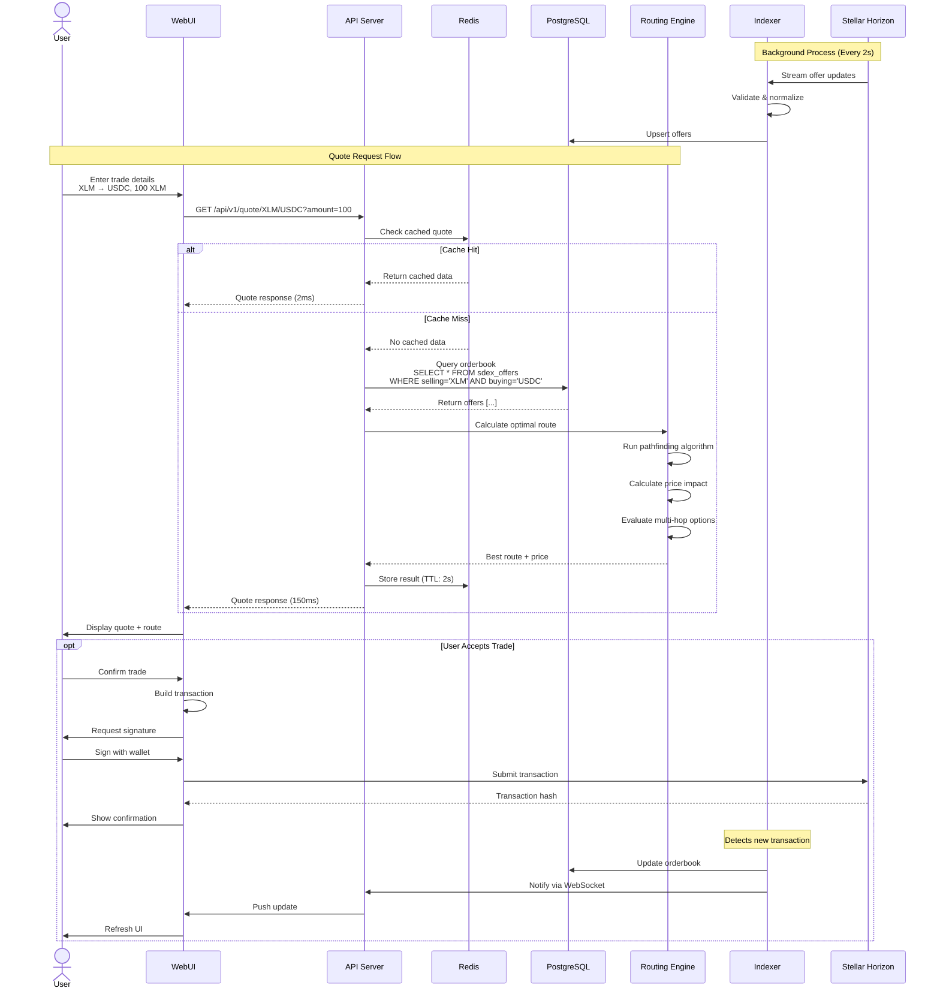

# StellarRoute Architecture Diagrams

This document contains visual diagrams explaining the architecture, data flow, and deployment of StellarRoute.

## Table of Contents

- [System Architecture](#system-architecture)
- [Data Flow Diagram](#data-flow-diagram)
- [Deployment Architecture](#deployment-architecture)
- [Database Schema (ERD)](#database-schema-erd)
- [Component Interaction Sequence](#component-interaction-sequence)

---

## System Architecture

This diagram shows the high-level components of StellarRoute and how they interact.



### Components Description

**Indexer Service**

- Continuously syncs SDEX orderbook data from Horizon API
- Indexes Soroban AMM pool states
- Normalizes and stores data in PostgreSQL
- Implements retry logic and rate limiting

**Routing Engine**

- Implements pathfinding algorithms (Dijkstra, A\*)
- Calculates optimal multi-hop routes
- Considers price impact and slippage
- Evaluates SDEX + AMM combinations

**API Server**

- RESTful endpoints for quotes and orderbook data
- WebSocket support for real-time updates
- Rate limiting and caching
- OpenAPI/Swagger documentation

**Smart Contracts**

- Soroban-based router contracts
- Atomic swap execution
- Multi-hop routing on-chain
- Slippage protection

---

## Data Flow Diagram

This diagram illustrates how data flows through the system from ingestion to user interaction.



### Data Flow Stages

1. **Request Phase**: User requests quote through API
2. **Cache Layer**: Check Redis for recent results
3. **Query Phase**: Fetch orderbook from PostgreSQL
4. **Routing Phase**: Calculate optimal path considering multi-hop
5. **Response Phase**: Return quote with price impact
6. **Execution Phase**: User signs and submits transaction
7. **Background Sync**: Continuous indexing from Horizon

---

## Deployment Architecture

This diagram shows the deployment topology and infrastructure components.

```mermaid
graph TB
    subgraph "Internet"
        Users[Users/Traders]
        Devs[Third-party Apps]
    end

    subgraph "Load Balancer / CDN"
        LB[Nginx / Cloudflare<br/>SSL Termination]
    end

    subgraph "Application Tier - Docker Containers"
        subgraph "API Cluster"
            API1[API Server 1<br/>:3000]
            API2[API Server 2<br/>:3000]
            API3[API Server 3<br/>:3000]
        end

        subgraph "Indexer Cluster"
            Indexer1[Indexer 1<br/>Primary]
            Indexer2[Indexer 2<br/>Standby]
        end

        subgraph "Frontend"
            Frontend[Next.js App<br/>Static + SSR]
        end
    end

    subgraph "Data Tier"
        subgraph "Database Cluster"
            PG_Primary[(PostgreSQL<br/>Primary<br/>:5432)]
            PG_Replica[(PostgreSQL<br/>Read Replica<br/>:5432)]
        end

        subgraph "Cache Cluster"
            Redis_Master[(Redis Master<br/>:6379)]
            Redis_Replica[(Redis Replica<br/>:6379)]
        end
    end

    subgraph "Monitoring & Logging"
        Prometheus[Prometheus<br/>Metrics]
        Grafana[Grafana<br/>Dashboards]
        Loki[Loki<br/>Logs]
    end

    subgraph "External Services"
        Horizon[Stellar Horizon API<br/>horizon.stellar.org]
        Soroban[Soroban RPC<br/>soroban-rpc.stellar.org]
    end

    %% Traffic Flow
    Users --> LB
    Devs --> LB
    LB --> Frontend
    LB --> API1
    LB --> API2
    LB --> API3

    %% API to Data
    API1 --> Redis_Master
    API2 --> Redis_Master
    API3 --> Redis_Master
    API1 --> PG_Primary
    API2 --> PG_Replica
    API3 --> PG_Replica

    %% Indexer to Data
    Indexer1 --> PG_Primary
    Indexer2 --> PG_Primary
    Indexer1 --> Horizon
    Indexer2 --> Horizon
    Indexer1 --> Soroban

    %% Data Replication
    PG_Primary -.->|Streaming<br/>Replication| PG_Replica
    Redis_Master -.->|Replication| Redis_Replica

    %% Monitoring
    API1 --> Prometheus
    API2 --> Prometheus
    API3 --> Prometheus
    Indexer1 --> Prometheus
    PG_Primary --> Prometheus
    Redis_Master --> Prometheus
    Prometheus --> Grafana
    API1 --> Loki
    Indexer1 --> Loki

    style LB fill:#e1f5ff
    style API1 fill:#e1ffe1
    style API2 fill:#e1ffe1
    style API3 fill:#e1ffe1
    style Indexer1 fill:#e1ffe1
    style PG_Primary fill:#fff4e1
    style Redis_Master fill:#ffe1e1
    style Prometheus fill:#f5e1ff
    style Frontend fill:#e1f5ff
```

### Deployment Details

**Infrastructure Layer**

- Load balancer with SSL termination (Nginx/Cloudflare)
- Horizontal scaling for API servers (3+ instances)
- Container orchestration with Docker Compose/Kubernetes

**Application Layer**

- API servers: Stateless, can scale horizontally
- Indexer service: Primary/standby setup for high availability
- Frontend: Static assets + server-side rendering

**Data Layer**

- PostgreSQL: Primary-replica setup for read scaling
- Redis: Master-replica for cache availability
- Connection pooling for efficient database access

**Monitoring Stack**

- Prometheus: Metrics collection
- Grafana: Visualization dashboards
- Loki: Centralized logging

**High Availability**

- Multiple API instances behind load balancer
- Database replication for failover
- Cache replication for redundancy
- Health checks and auto-restart

---

## Database Schema (ERD)

Complete entity relationship diagram showing all tables and their relationships.



### Key Relationships

- **assets → sdex_offers**: One asset can be in many offers (both as selling and buying)
- **assets → trading_pairs**: Each trading pair has a base and counter asset
- **trading_pairs → orderbook_snapshots**: Each pair can have multiple historical snapshots
- **archived_offers**: Standalone table for historical data (denormalized)

### Index Strategy

Primary indexes on all tables support:

- Fast lookups by primary key
- Efficient joins on foreign keys
- Time-series queries (timestamps)
- Price-based sorting for orderbook queries

---

## Component Interaction Sequence

Detailed sequence diagram showing how components interact during a typical quote request.



### Interaction Patterns

**Quote Request (Happy Path)**

1. User enters trade parameters in UI
2. API checks Redis cache (2s TTL)
3. On cache miss, queries PostgreSQL
4. Routing engine calculates best path
5. Result cached and returned to user
6. Total latency: ~150ms (cache miss), ~2ms (cache hit)

**Background Indexing**

1. Indexer polls Horizon API every 2 seconds
2. Validates and normalizes offer data
3. Upserts into PostgreSQL
4. Notifies WebSocket clients of updates

**Trade Execution**

1. User confirms trade parameters
2. Frontend builds transaction
3. User signs with wallet (Freighter/XBull)
4. Transaction submitted to Stellar network
5. Indexer detects change and updates database
6. Real-time notification to connected clients

---

## Diagram Source Files

All diagrams in this document are created using [Mermaid](https://mermaid.js.org/), a markdown-based diagramming tool that renders in GitHub, GitLab, and most modern documentation platforms.

### How to Edit

1. **In GitHub**: Diagrams render automatically in `.md` files
2. **Live Editor**: Use [Mermaid Live Editor](https://mermaid.live/) to modify diagrams
3. **VS Code**: Install "Markdown Preview Mermaid Support" extension
4. **Export**: Use Mermaid CLI or live editor to export as SVG/PNG

### Syntax Reference

````markdown
````mermaid
graph TD
    A[Start] --> B[Process]
    B --> C[End]
\```
````
````

### Updating Diagrams

When updating system architecture:

1. Edit the Mermaid code in this file
2. Verify rendering in GitHub preview
3. Update related documentation if component relationships change
4. Commit changes with descriptive message

---

## Additional Resources

- [Database Schema Details](./database-schema.md)
- [API Documentation](../api/README.md)
- [Deployment Guide](../deployment/README.md)
- [Development Setup](../development/SETUP.md)

---

**Last Updated**: February 20, 2026  
**Maintained By**: StellarRoute Team
